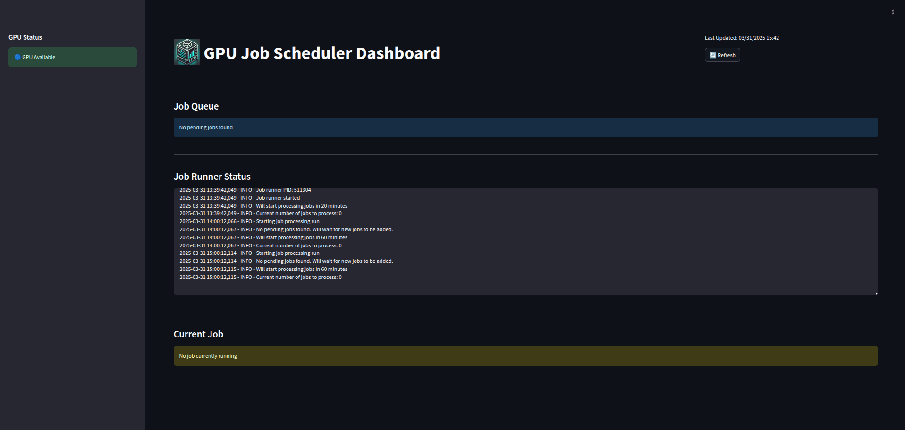

# JobLister Dashboard Guide

The JobLister dashboard is a Streamlit-based web interface that provides real-time monitoring and management of GPU jobs.

## Features

### 1. GPU Status Panel

Located in the sidebar, shows:

- Current GPU availability (🔵 Available or 🔴 In Use)
- For running jobs:
    - User running the job
    - Script name
    - Start time
    - Process ID (PID)
    - Job type (SQL or CLI)
    - Job ID (for SQL jobs)

### 2. Job Queue Display

Shows a comprehensive table of jobs with:

- Job ID
- Program name
- Python environment path
- User
- Email address
- Status
- Creation time
- Start time
- Completion time
- Error messages (if any)

#### Filtering Options

- Filter jobs by status (Pending, Running, Completed, Failed)
- Shows jobs from the current day and all pending jobs

### 3. Real-time Job Output

The dashboard provides real-time output display for currently running jobs:

#### Current Job Output

- Automatically captures and displays output from the running job's tmux session
- Updates in real-time as the dashboard refreshes
- Shows complete terminal output including errors and progress

#### Job Runner Status

- Displays the latest JobRunner log file
- Shows service status and any system-level messages
- Updates automatically with new log entries

## Usage

### Accessing the Dashboard

1. Open a web browser
2. Navigate to `http://<server_ip>:<port>/<app_name>`
   - Example: `http://localhost:8502/gpujobs`

### Refreshing Data

- Click the "🔄 Refresh" button in the top right

### Monitoring Jobs

1. Check the GPU Status panel for current GPU usage
2. View the Job Queue table for job status
3. Monitor real-time output in the Current Job section
