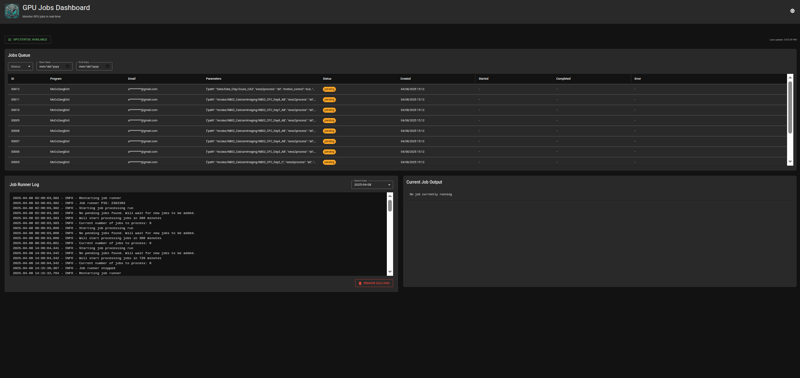

# JobLister Dashboard Guide

The JobLister dashboard is a FastAPI-based web interface that provides real-time monitoring and management of GPU jobs.

## Features

### 1. GPU Status Panel

Located in the sidebar, and can be accessed by clicked the `GPU STATUS` button when it says `IN USE` shows:

- User running the job
- Script name
- Start time
- Process ID (PID)
- Job type (SQL or CLI)
- Job ID (for SQL jobs)

When the GPU says `AVAILABLE` sidebar is not accessible.

### 2. Job Queue Display

Shows a comprehensive table of jobs with:

- Job ID
- Program name
- Email address
- Status
- Creation time
- Start time
- Completion time
- Error messages (if any)

#### Filtering Options

- Filter jobs by status (Pending, Running, Completed, Failed) or by date

### 3. Real-time Output

The dashboard provides real-time output display for currently running jobs and status of the job runner:

#### Current Job Output

- Automatically captures and displays output from the running job's tmux session
- Updates in real-time as the dashboard refreshes
- Shows complete terminal output including errors and progress
- Source of progress is a captured pane from the tmux session stored in `logs/tmux4wa`

#### Job Runner Status

- Displays the latest JobRunner log file
- Shows service status and any system-level messages
- Can filter logs by date
- When more than 7 days worth of logs are found, user is provided option to clear all logs older than 7 days

## Accessing the Dashboard

1. Open a web browser
2. Navigate to:
    - `0.0.0.0:[PORT]` on local machine
    - `[BROADCAST_IP]:[PORT]` from remote machine
    - by default the port is set to `8000`, but can be modified in [`/ServerService/templates/app_settings.json`](/ServerService/templates/app_settings.json)
